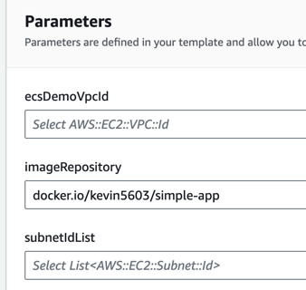
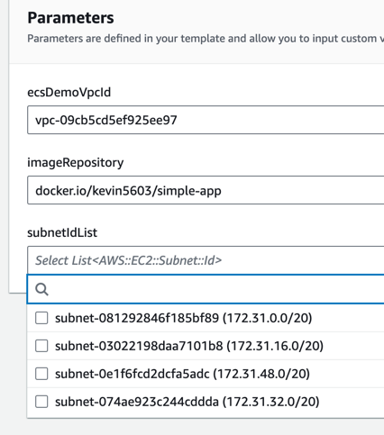
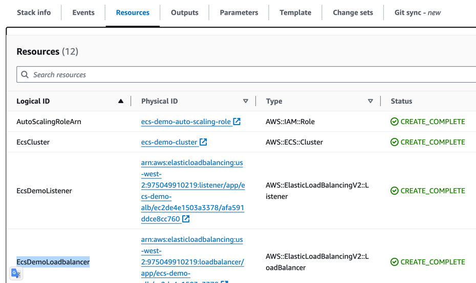
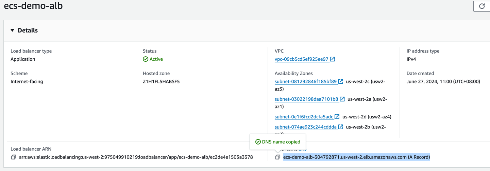
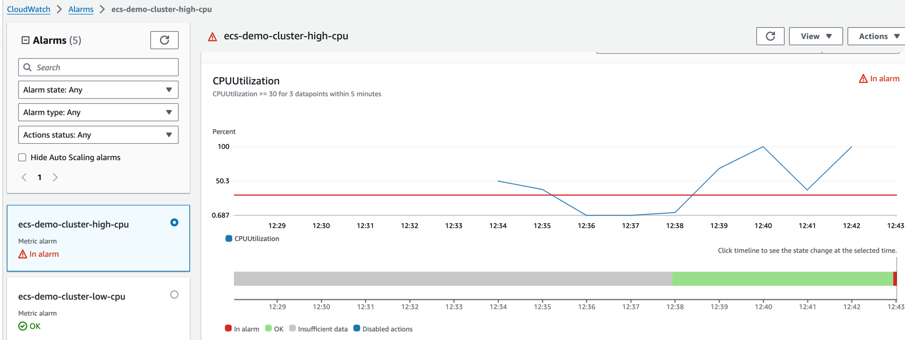

## 注意事項
### 有些aws服務不是用免費方案所以測試完記得要把stack刪掉
## 打包流程
1.打包jar檔
``` sh
mvn clean package
```
2.打包成image並推到自己的repository
記得把${docker_username}改成自己帳號
！如果有改code記得要重新mvn clean package
``` sh
docker login
docker build -t ${docker_username}/simple-app --platform linux/amd64 . 
docker tag ${docker_username}/simple-app ${docker_username}/simple-app 
docker push ${docker_username}/simple-app
```

3.到aws cloudformation 點選create stack上傳ecs.yml


4.(optional)imageRepository改成自己的image


5.ecsDemoVpcId & subnetIdList選擇自己的vpc ＆ subnets


6.一路點擊next，最後按submit


7.stack創建成功！


8.點選resources可以所創建的resource
並點選EcsDemoLoadbalancer進入alb console


9.複製DNS name這是我們的public domain name


10.如果成功就會看到以下畫面


11.如果當前有多台機器，他會AWSALB來黏住當前session，把它刪掉就可以就有可能會導到不同的機器


12.可以到cloudwatch觀察log


13.測試完畢刪除資源，到cloudformation點擊剛創建的stack
點擊delete即可把stack內所有資源刪除


14.可以用/cpu這隻API來測試auto scale





## ECS 可能會用到指令
停止指定task
``` sh
aws ecs stop-task --cluster ${cluster_name} --task ${task_ARN}
```
檢查 custom_params 是否為自己使用的
- awslogs-region
- subnetsArn
- imageRepository (optional)


